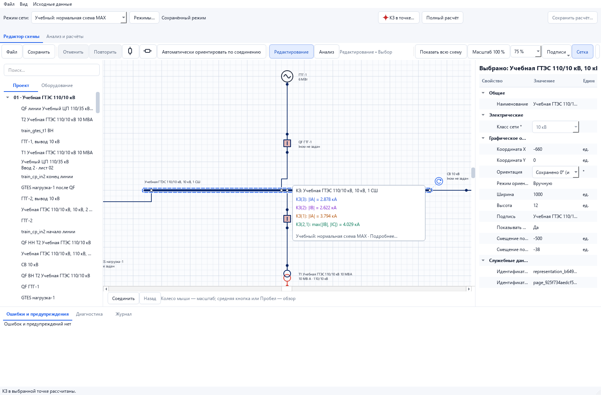

# РЗА-Про — схемы электрических сетей, ТКЗ и релейная защита

Приложение для Windows: редактор однолинейных схем, исходные данные оборудования,
режимы сети, расчёт токов короткого замыкания и проверка уставок защит.

## Где проект сейчас — 09.09.2026

Приложение **0.3.3** · карта **4.2**.

**BU01–BU04 плана «снизу вверх» завершены в согласованном объёме.**
Последний завершённый этап — **4: топология, режимы и единый расчётный снимок**.
**BU05 выполняется:** первый блок составляющих токов ветвей от КЗ ΔI и
идеальных вторичных токов ТТ реализован и проверен в описанном объёме.
Полная инженерная приёмка BU05–BU08 этим блоком не заявлена.

Текущая полная проверка: **3812 тестов прошли, 0 отказов, 0 пропусков**,
коммит [`35eef53`](https://github.com/blissofhaven/test123/commit/35eef5335251d757d6b7178445c85d5a1a1ed645).
[Отчёт проверки](docs/work-verification/startup-point-fault-2026-09-09.md) включает
запуск Windows, независимую сверку КЗ и ограничения проверенного объёма.

Добавлены [выбор проекта и КЗ в точке](docs/point-fault-workflow.md):
обычный запуск показывает окно выбора, открытие схемы не запускает полный расчёт.
Рядом с выбранной точкой выводится один блок с цветными строками.



**Расчёты имеют предварительный инженерный статус.** Наличие четырёх видов КЗ
и успешные программные тесты не заменяют приёмку моделей, методики и реального объекта.
Процент готовности к промышленной эксплуатации пока не назначен.

## Что уже можно делать

- Рисовать многостраничную схему: шины, выключатели, трансформаторы и линии;
  перемещать связанные аппараты, закреплять изгибы, отменять и повторять изменения.
  Для связи выбираются обычное соединение, КЛ или ВЛ; на другом листе можно открыть
  нужное присоединение двойным щелчком по переходу.
- Выбирать проект при запуске: недавние файлы, открытие, новый пустой проект
  и копия учебной схемы. Автооткрытие последнего включается отдельно.
  [Компактная сеть 110/35/10/0,4 кВ](docs/compact-training.md) содержит четыре листа.
  Большой учебный нефтепромысел «Таёжный» сохранён: ГТЭС,
  **34 листа, 1016 аппаратов и 1172 трассы**, двухвводные подстанции и КТП.
  Его данные демонстрационные и требуют заполнения и подтверждения для реального объекта.
- Заполнять [карточки, таблицу и справочник оборудования](docs/engineering-parameters.md):
  источники/генераторы, трансформаторы, КЛ/ВЛ, выключатели, нагрузки и параметры ТТ
  в присоединении. Поддерживаются черновики, источник и подтверждение значений,
  переключение единиц, вставка блока из Excel с проверкой перед применением.
- Включать и отключать выключатели двойным щелчком в редакторе и анализе:
  переключения попадают в черновик режима, затем применяются одной командой.
- Управлять [режимами сети](docs/operating-modes.md): общий выбор для редактора
  и анализа, черновик переключений, сравнение перед применением, параметры источников
  и нагрузки. Для кольцевого и параллельного питания вводятся внешние рабочие токи
  на стороне ТТ с источником и подтверждением.
- Запускать расчёт кнопкой, видеть прогресс и отменять его; сохранять исходный
  расчётный снимок для повторного запуска. Изменение электрических данных помечает
  прежние результаты устаревшими. GUI и командная строка используют общий вход.
- По правой кнопке на шине или подключённом выводе выбирать **«Рассчитать КЗ здесь…»**.
  Рядом появляется один компактный блок с цветными строками; подробности открываются нажатием.
  Можно выбрать **трёхфазное, двухфазное, однофазное на землю
  и двухфазное на землю КЗ** при достаточных данных. Выводятся фазные токи,
  остаточные напряжения и 3I0. Требуемые Z2/Z0 и путь нулевой последовательности
  должны быть заданы; неподдерживаемые случаи явно ограничиваются.
- В первом блоке [«КЗ → Ветви и ТТ»](docs/fault-branch-currents.md) выбирать
  измеряемую ветвь и смотреть ΔIA/ΔIB/ΔIC и 3ΔI0 обоих физических концов на их
  ступенях, а при заданном ТТ — идеальные вторичные токи в А. Доаварийный ток
  нагрузки не добавлен; насыщение, погрешность и полярность вторичных цепей
  не моделируются. Отсутствующие или неподтверждённые данные показаны явно.

[Как вычисляются комплексные числа и четыре вида КЗ](docs/calculation-audit/four-faults-explained.md) —
формулы, единицы, ссылки на код и запускаемый пример.

Существующие МТЗ/ТО/ОЗЗ остаются переходным расчётным слоем; новый просмотр
не заменяет автоматически их исходные токи.

Согласованный порядок: **четыре вида КЗ → токи ветвей и мест ТТ → ввод своих
уставок МТЗ/ТО без направления и их проверка**. Следующий прикладной блок
описан в [плане ввода уставок](docs/roadmap/protection-input-plan.md).
Точное исполнение БМРЗ и версия его ПО пока не выбраны; заводские диапазоны
и шаги уставок не приняты. Общий ввод не означает готовый профиль терминала.

## Что планируется

| Этап | Следующий результат | Состояние |
|---|---|---|
| 5 | Проверенные модели элементов и схемы последовательностей; первый блок ΔI ветвей и идеального ТТ | Выполняется; первый блок проверен в описанном объёме |
| 6 | Инженерная проверка всех четырёх КЗ на независимых контрольных случаях | Планируется |
| 7 | Полные напряжения узлов, токи обоих концов ветвей и вклады источников | Полная приёмка впереди; первый просмотр ΔI включён в BU05 |
| 8 | Измерения ТТ/ТН, внутренние точки КЗ и полный набор обязательных сценариев | Полная приёмка впереди; идеальное масштабирование ТТ включено в BU05 |
| 9 | Ввод своих МТЗ/ТО без направления и проверка на токах конкретного ТТ | Следующий прикладной блок после проверки токов |
| 10 | Конкретный терминал, допустимые уставки и селективность | Планируется |
| 11 | ОЗЗ с учётом фактической нейтрали, ёмкостей и выбранного метода | Планируется |
| 12 | Единый протокол, экспорт и приёмка выбранного объекта | Планируется |

[Полный порядок и критерии готовности](docs/roadmap/ROADMAP.md) ·
[Текущее состояние и ограничения](docs/roadmap/current-state.md) ·
[Статус для разработчиков](docs/roadmap/status.json).

При открытии схемы полный расчёт не выполняется. Загрузка данных и построение
большой сцены всё ещё требуют времени. Точечный и полный расчёты запускаются отдельно
в фоне с отменой. Внутри КЛ/ВЛ по расстоянию КЗ пока не выбирается: доступны её физические концы.
Полноценное распределение мощности, двигательная подпитка, временные составляющие
тока КЗ, расширенные модели трансформаторов и дополнительные защиты — отдельные расширения.

## Как запустить

Откройте **`ЗАПУСК.bat`** в папке проекта. Перед перезапуском сохраните свою схему.
Подробности — [КАК ЗАПУСТИТЬ.txt](КАК%20ЗАПУСТИТЬ.txt).
Обычный запуск открывает окно выбора. На вкладке учебных схем можно создать
свою копию компактной сети или нефтепромысла. Путь в командной строке открывается напрямую, без полного расчёта.

```text
python -m rza_calc.gui
python -m rza_calc.gui C:\Проекты\мой-проект.json
python -m rza_calc rza_calc/examples/oilfield_gtes.json report
```

Зависимости и установка — в инструкции запуска. Последняя проверенная среда:
Windows, Python 3.14.7, NumPy 2.5.2, PySide6 6.11.2, pytest 9.1.1.
Обычная работа после установки зависимостей не требует интернета.

Для проверки используется штатный pytest:

```text
python -m pytest tests --capture=sys
```

Исторический мини-запускатель без Qt не заменяет полный набор тестов.
Четыре КЗ можно изучить на техническом примере
[four_fault_types.json](tests/fixtures/legacy_projects/four_fault_types.json);
пользовательский пример по умолчанию —
[oilfield_gtes.json](rza_calc/examples/oilfield_gtes.json).

## Методика и данные

Профиль `rza_calc/data/methodology_default.json` имеет статус **«ТИПОВОЙ»**,
а не утверждённой методики конкретного объекта. Его источники и пункты требуют
проверки; паспортные значения и принятые допущения нужно подтвердить.
Демонстрационные справочники также не заменяют данные оборудования объекта.

## Где находятся файлы

- [rza_calc/](rza_calc/) — приложение; [tests/](tests/) — проверки и технические схемы.
- [tools/](tools/README.md) — служебные инструменты; для обычного запуска они не нужны.
- [docs/roadmap/](docs/roadmap/ROADMAP.md) — действующий план и статус.
- [docs/work-verification/](docs/work-verification/) — отчёты выполненных работ.
- [docs/archive/](docs/archive/README.md) — исторические материалы.

История изменений ведётся отдельными коммитами с описанием работ и проверок.
Старые A/B-этапы и прежние результаты сохранены как история; текущий порядок —
этапы 1–12 плана «снизу вверх».
