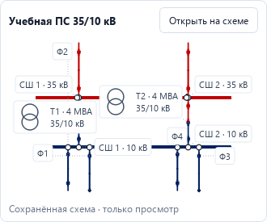

# Общий обзор объекта

Первый вариант проверен на [компактной учебной сети 110/35/10/0,4 кВ](compact-training.md).
Он помогает найти объект и открыть его сохранённый подробный лист.
Для этого блока прошли **319 затронутых тестов** и визуальная проверка:
[отчёт](work-verification/network-overview-2026-09-09.md) и
[доказательства](work-verification/network-overview-evidence.json).
Это отдельная проверка интерфейса, а не инженерная приёмка расчётных моделей.

## Как пользоваться

1. Запустите программу и выберите проект. После загрузки откроется вкладка
   **«Обзор объекта»**. Полный расчёт при этом не запускается.
2. Выберите ГТЭС, подстанцию, секцию или аппарат в дереве слева. Строка поиска
   и фильтр по типу оборудования помогают найти нужный элемент.
3. Один щелчок по карточке или строке дерева показывает мини-схему справа.
   Если объект представлен на нескольких листах, выберите нужный лист под мини-схемой.
4. Двойной щелчок по объекту или кнопка открытия мини-схемы переводит на
   подробный лист. Там доступны редактирование, черновик режима и выбор точки КЗ.
5. Кнопка **«Обзор объекта»** возвращает к обзору. Для посещённого подробного
   листа сохраняются вид и выделение; явный выбор аппарата или линии открывает
   соответствующее изображение.

Мини-схема не редактирует оборудование и не переключает выключатели.
Чтобы выполнить КЗ, откройте подробный лист и выберите физическую шину или
подключённый вывод: [порядок точечного расчёта](point-fault-workflow.md).

## Что означает дерево и цвет

Структура строится по сохранённой принадлежности объектов и фактическим ссылкам
проекта. Названия аппаратов, близость рисунков и положение на листе не используются
для угадывания электрических связей. Оборудование с неясной принадлежностью
показывается отдельно с замечанием.

Контурные значки обозначают тип объекта и остаются нейтральными. Справа от
строки отдельно показаны класс напряжения, состояние питания и признак ремонта.
Состояние определяется по выбранному режиму и его активным связям. Оно не
означает успешную проверку защиты, допустимую нагрузку или безопасное переключение.
Разомкнутая цепь аппарата не означает, что все его выводы обесточены.
Неизвестное состояние не заменяется состоянием «включено».

Линии между обзорными карточками обозначают установленные межобъектные связи.
Стрелка показывает объявленную связь, а не направление мощности. В компактном
примере есть четыре объекта и шесть межобъектных линий: по два ввода у ЦП, ПС и КТП.
Вводы и секционные выключатели не включаются в число отходящих фидеров.

## Карточки и нижние вкладки

Краткие карточки перестраиваются по ширине окна. Ниже находятся семь разделов:
**«Сеть», «Режимы», «Нагрузки», «КЗ», «Уставки», «Селективность», «Отчёт»**.
Кнопка **«Свернуть итоги»** освобождает место для схемы.

Обзор показывает переданные готовые сведения выбранного объекта. Он не
запускает расчёт при смене вкладки. В разделе КЗ могут появиться только
актуальные результаты ранее выполненного точечного запроса, относящиеся к
выбранному объекту. Не выполненные или недоступные проверки обозначаются
текстом; пустое место не подменяется нулевым током или успешным результатом.
Раздел «Отчёт» содержит замечания к структуре и привязкам, а не готовый
инженерный протокол объекта.

## Перемещение карточек

Карточки общего обзора можно перемещать. Изменение попадает в историю проекта:
его можно отменить и повторить. Обычное сохранение проекта записывает новое
расположение. Подробные аппараты, шины, трассы, электрические связи и параметры
при этом остаются прежними.

## Подписи мини-схемы

Трансформаторы показаны увеличенными контурными обмотками рядом с Т1/Т2,
мощностью и напряжениями. Размер обозначения — 32 экранных пикселя;
пунктирная выноска указывает настоящий аппарат. Она не является проводом.
Подробная схема сохраняет прежние обозначения, выводы и маршруты.

На шинах подписаны секция и напряжение. Фидеры показаны номером; назначение
доступно при наведении. Номера не меняются при переходе к РУ, секции или ячейке.
Под мини-схемой можно выбрать «Весь объект» или одно из действительных РУ.

## Следующий шаг

Следующий согласованный шаг после просмотра компактного варианта — группировка
обзора большого нефтепромысла и ручное назначение принадлежности оборудования
объектам. Эти возможности ещё не реализованы. Большой учебный файл сохранён,
но его читаемость и масштабирование нового обзора пока не приняты.

Обзор не добавляет расчёт потокораспределения, новые модели КЗ или проверки
уставок. Полная инженерная приёмка BU05–BU08 остаётся отдельной работой:
[действующий план](roadmap/ROADMAP.md).
