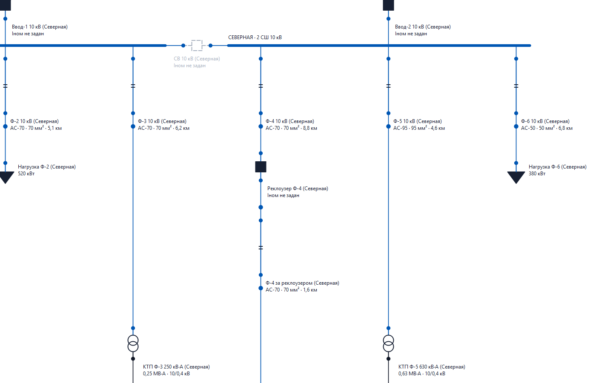
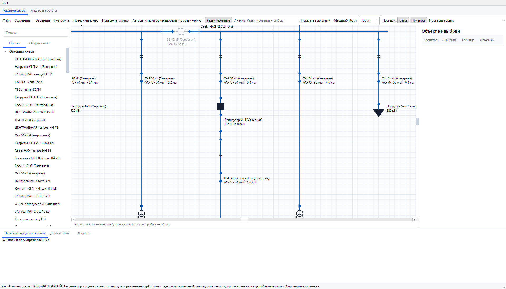
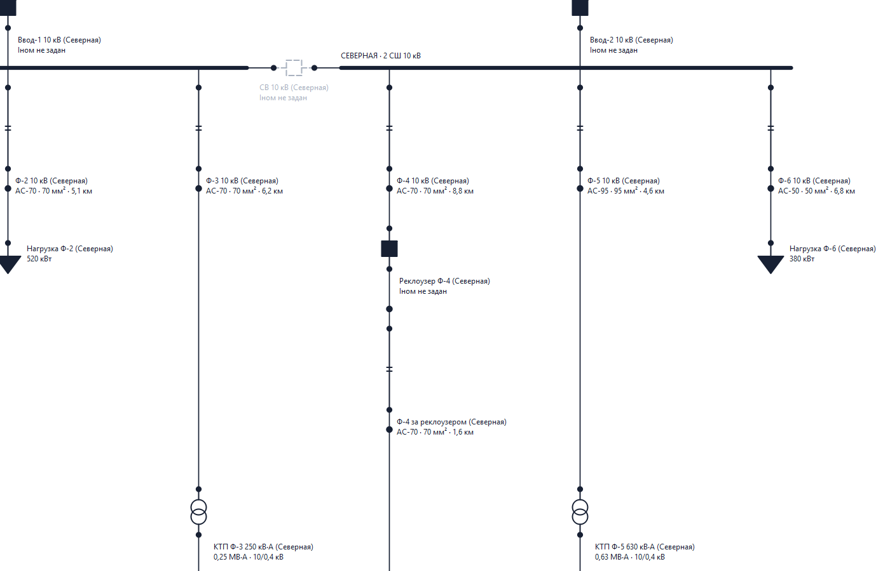
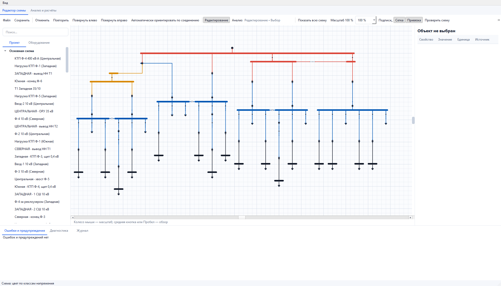

# B3 — подписи «имя + главный параметр»

Дата: 31.08.2026. Исполнитель: Sol. Основание: отдельная команда заказчика
«делай В3». ТЗ: `docs/roadmap/stages/B3-labels.md`.

## 1. Входной контроль

Работа выполнена только в
`C:\Users\shock\OneDrive\Desktop\Клауд\rza-calc-0.3-safe-hardening`.
Эта папка отсутствовала и была восстановлена из готового архива A2.1, а не
из старой `rza-calc-0.3`. Готовая распакованная A2.1 не изменялась.

До правок прочитаны бриф целиком, передача B3, передача и отчёты A2/A2.1,
ТЗ B3, карта статуса и правила совместной работы. В исходном архиве нет
двух документов UI-UX-1; полностью прочитаны их копии, приложенные заказчиком
из `Новая папка`. Работа UI-UX-1 повторно не выполнялась.

Команды из корня проекта:

```text
python -B -X utf8 -m pytest -q -p no:cacheprovider
python -B -X utf8 -m pytest -q tests/test_roadmap_consistency.py tests/test_demo_diagram.py tests/test_stage3_requirements.py
python -B -X utf8 tools_update_baseline.py --stage ПРОВЕРКА --reason "вход B3 из A2.1" --evidence "входной прогон"
python -B -X utf8 -m rza_calc rza_calc/examples/energoraion.json table
python -B -X utf8 -m rza_calc.gui rza_calc/examples/energoraion.json --smoke-test
```

Результат входа: **1007 passed in 112.85s**, целевые проверки **36 passed**,
эталон чист, GUI smoke — код 0. Демо: **116 OK / 3 FAIL / 0 unresolved**,
код 1 отражает три известных содержательных нарушения, не сбой запуска.
Подробности первоначального сбоя Windows — в разделе 6.

## 2. Контрольная точка

До правок сохранён `rza-2026-08-31-B3-before.zip`, побайтовая копия
`rza-2026-08-31-A2.1-done.zip`.

SHA-256 исходного архива:
`cc8a325f4dbf8fd9a496ff4eb2b27b3b9240952888e599d753cbe7ca227d50b5`.

SHA-256 эталона до и после:
`eb117b54e6117a4c83f612215b6ef7126f1bd303bae524e73fc60649b671f9d0`.

SHA-256 журнала эталона до и после:
`b291569479a64b59da895da2ba4a8761acce64b2e04fbe89b9d5997e2ad745e9`.

Зазор **4 единицы сцены**, скрытие при масштабе **< 0,6** и правило ручных
позиций установлены до измерения, в [B3-control-point.md](B3-control-point.md).
Не менялись допуски, эталон или его журнал.

## 3. Что сделано — по пунктам ТЗ

### 3.1. Главный параметр

Один читающий адаптер `editor/labels.py` обслуживает редактор и анализ.
Он читает действующие свойства модели и сохранённый `legacy_payload`,
не строит расчётный DTO и не вызывает расчёт.

| Оборудование | Подпись параметра |
|---|---|
| Трансформатор 2W/3W | Sном и паспортные Uном, например `16 МВ·А · 110/10 кВ` |
| Линия/кабель | Марка, сечение в мм², длина в км |
| Выключатель, секционный аппарат, реклоузер | Iном в А |
| Нагрузка | P в кВт или МВт |
| Генератор | Pном в МВт |

Параметры отсутствуют — показано «не задан», а не выдуманное число.
Некорректные данные и конфликтующие имена одного свойства раскрываются
в подсказке. Из одного сечения не сочиняется число жил `3×`; P генератора
не вычисляется догадкой из S и cosφ. Неподтверждённая длина так и помечена.
У составной физической линии неодинаковые участки не выдаются за один кабель:
краткая подпись сообщает составность, подсказка перечисляет участки.

Реальные физические линии, изображённые только `DiagramRoute`, тоже получают
подпись. Для этого не создаются фиктивные аппараты, представления или ID.
При наличии отдельного представления оборудования вторая подпись на трассе
не дублируется. Обычное графическое соединение не становится оборудованием.

### 3.2. Расстановка и ручной приоритет

Алгоритм детерминирован: учитывает прямоугольники текста, видимую геометрию
символов и толщину проводов; ручные позиции занимают место первыми.
Подписи ограничены шириной 220 единиц с переносами без обрезания текста.
Автоматическая раскладка не записывает координаты в электрическую модель
или документ при простом отображении.

**Совместимость:** старый формат не записывал происхождение label_x/y.
У всех 157 представлений демо координаты явные. Нельзя достоверно отделить
ручную правку человека от старого генератора, поэтому все такие позиции
сохраняются. Новые подписи автоматические. Явная команда тулбара
**«Подписи → Автоподписи: выбранные / вся страница»** переводит выбранные
представления и физические линии, либо страницу целиком, в автоматический
режим. Это одна отменяемая графическая команда; скрытые подписи не открывает.

На демо исходные закреплённые позиции дают 32 диагностики пересечений после
добавления параметров. После явной команды: **0 пересечений**, 120 видимых
подписей, 37 исходно скрытых сохранены. Демо-файл на диске не переписывался.
Если пользователь вручную оставил пересечение, положение сохраняется,
а интерфейс сообщает о нём. Если места рядом не найдено в ограниченном
поиске, также выдаётся диагностика; универсальная идеальная раскладка
произвольной сети не заявляется.

### 3.3. Управление видимостью

В тулбаре редактора — меню «Подписи» с переключателями подписей и параметров;
те же действия доступны через меню «Вид» во вкладке анализа. Состояние
хранится в графических настройках проекта. Общий переключатель скрывает
весь блок, переключатель параметров — его вторую часть.

«Результаты расчёта (B4)» явно недоступны с пояснением: B4 не реализован.
Переключения не запускают расчёт и не меняют электрические данные.

### 3.4. Масштаб

При масштабе меньше 60% подписи скрываются, при возврате восстанавливаются
с прежними предпочтениями. Скрытие из-за масштаба не выключает индивидуальную
видимость в сохранённом проекте и не заставляет раскладку прыгать.

### 3.5. Поворот и перемещение

Текст контрповёрнут и остаётся горизонтальным при 0/90/180/270° аппарата.
Закрыт **AUD-SYM-002**. Привязка остаётся локальной: перемещение аппарата
переносит его подпись, но не меняет постоянные порты или их смысловые роли.
У подписи физической трассы смещение отсчитывается от середины текущего пути.

Реальные события Qt выявили старый дефект: перетаскивание дочерней подписи
могло перемещать выбранный аппарат. Теперь перемещается только подпись.
Сохранение/открытие, undo/redo, повороты и трассы закреплены тестами.
Инспектор передаёт только действительно изменённое поле: правка текста
или видимости не превращает автоматическую позицию в ручную.

## 4. Чего я не понял и не тронул

Происхождение старых координат принципиально не восстановить по данным:
решение описано выше, скрытая миграция не выполнялась. Не менялись символы,
выводы, топология, расчётные каталоги, IO и физические параметры примеров.
Локальный адаптер подписей использует существующие единицы; A3 не подменён
самодельной новой моделью параметров.

## 5. Что потеряно и ограничения

Существующая функциональность не удалялась; прежние тесты не правились.
Старое ручное размещение сохраняется, поэтому открытие старой схемы само
по себе не обещает отсутствия пересечений. Команда автоподписей явно доступна.
Результаты на схеме — следующий B4, выпуск чертежей — B7, масштабирование
расчётного ядра и производительность больших сетей — A11. Они не начаты.

Ручная приёмка физической мышью пользователем не выполнялась. Выполнены
QTest-события и визуальная проверка PNG настоящего Windows Qt-рендера.
Профиль методики остаётся ТИПОВЫМ, 19/21 источников не сверены по пунктам;
B3 не является утверждением методики или промышленной приёмкой расчёта.

## 6. Прогон тестов и ревью

- Входной чистый повтор: **1007 passed in 112.85s**.
- Новые тесты B3: **78 passed in 9.58s**, два новых файла; 75 проверок
  функциональности и ещё три проверки эквивалентности оптимизации.
- Итоговый полный прогон: **1085 passed in 178.05s (0:02:58), 0 failed**.
  Команда: `python -B -X utf8 -m pytest -q -p no:cacheprovider --durations=5`.
- После обновления карты, брифа и status.json: **131 passed in 11.57s**
  (roadmap + B2 + B3); GUI smoke — код 0. Версия документов 3.7,
  B3 = done, current_turn = Max. Сверка эталона повторена: расхождений нет.
- Независимое финальное ревью: блокирующих замечаний нет; семь адресных
  проверок инспектора, синхронизации видимости и режима анализа пройдены.

Первый входной полный прогон дал 993 passed / 14 failed. Все 14 отказов
происходили до запуска дочерней программы, в Windows `DuplicateHandle`
при наследовании stdin (`WinError 50`). Без правок кода тот же CLI-набор
прошёл 19/19, затем полный повтор — 1007/1007. Это не выдаётся за успешный
первый прогон. Воспроизводимого дефекта продукта на входе не осталось.

Во время B3 исправлены обнаруженные тестами/ревью дефекты: перетаскивание
аппарата вместо подписи, случайное закрепление через инспектор, устаревший
кэш видимости и сброс раскладки при смене режима. Один старый тест ожидал
сырой текст индивидуально скрытой подписи: совместимость восстановлена
в продукте, сам тест не ослаблялся. Ошибочный импорт в новом тесте исправлен.

Первый послереализационный общий прогон был остановлен после 734 успешных
проверок: профиль выявил лишнее полное перечисление препятствий для каждого
кандидата автоподписи. Его неполный журнал сохранён отдельно и не выдан
за приёмку. Включены ранний выход при первом пересечении, кэш порядка колец
и устранение лишних QPointF. Порядок кандидатов, зазор и позиции не менялись;
это проверено сравнением с прежним полным алгоритмом и независимым ревью.
Эксперимент с объединёнными QPainterPath отклонён: он менял трактовку
касания границ. Числовые/NumPy-прототипы не вошли в продукт.

**Оставшееся ограничение B3-PERF-001:** автоматическая расстановка на крайне
плотной искусственной схеме 1024 элементов остаётся дорогой. Промежуточный
отдельный тест после раннего выхода, до устранения QPointF: **91.14s**.
Он включает создание проекта, открытие, выделение, перемещение и масштаб;
это не измерение только открытия окна. Не выдаётся за приёмку быстродействия
больших схем. Продолжение — B9; исходный функциональный тест не ослаблялся.
Итоговое время того же теста — **76.92s** в полном прогоне. Порог приёмки
по времени не придумывался задним числом; ограничение записано в status.json
как открытый дефект B3-PERF-001, продолжение B9 требует отдельного задания.

Доказательства: [полный вывод](B3-Sol-20260831/pytest-full.txt),
[проверки после документации](B3-Sol-20260831/post-document-tests.txt),
[GUI-измерения](B3-Sol-20260831/gui-results.json),
[таблица демо](B3-Sol-20260831/demo-table.txt).

## 7. Сверка с эталоном

Вызов только читающий, **без `--yes`**:

```text
python -B -X utf8 tools_update_baseline.py --stage B3 --reason "итоговая проверка подписей B3" --evidence "полный pytest, инварианты портов и fingerprint"
```

Дословный вывод:

```text
Пересчитываю все демо-проекты…

Расхождений с эталоном нет.

Сводка для журнала: Числа не изменились (пересобран только формат снимка).
Этап: B3
Причина: итоговая проверка подписей B3
Подтверждение: полный pytest, инварианты портов и fingerprint

Числа не изменились — обновлять нечего. Эталон оставлен как есть.
```

Сохранён [сырой вывод](B3-Sol-20260831/baseline-check.txt).
Токи КЗ, уставки, выдержки, выбор определяющих режимов и селективность
совпали с эталоном A2. Его файл и журнал побайтово не изменились.

## 8. Контракт для Max / A3

```python
from rza_calc.editor.labels import present_label, present_route_label
content = present_label(model, representation)
text = content.text(show_name=True, show_parameters=True)
route_content = present_route_label(model, physical_route)
```

Результат — неизменяемый `LabelContent(name: str, parameter: str, tooltip: str)`.
Canvas использует эти поля; замена источника параметров в A3 локальна
в `editor/labels.py`. Гарантируется отсутствие расчёта/мутаций и выдуманных
значений; не гарантируется наличие параметра в неполном исходном проекте.

Единицы входа: `s_nom` — кВА; `u_hv/u_mv/u_lv` — кВ; `p_kw` — кВт;
`p_nom` — МВт; `rated_current_a` — А; `length_km` — км;
`cross_section_mm2/section_mm2` — мм². Физическая длина в `length_mm`
переводится из мм в км; данные строительных участков читаются с наследованием.

В существующем графическом контейнере `stage3_graphics`/`graphics` появился
`label_manual: bool`. Явные старые координаты без флага означают ручную
позицию; отсутствие координат — автоматическую. `label_x/y` остаются
локальными координатами, у трассы — смещением от середины пути.
Сериализация использует существующие extensions, формат проекта не повышен.
Настройки workspace: `show_labels`, `show_parameters`, `show_results` (bool).

Графические команды: `set_label`, `set_route_label`,
`reset_label_positions(representation_ids, route_ids=...)`,
`reset_route_label_positions`, `set_label_display`.
Изменения текста/видимости минимальны; ввод координат закрепляет подпись.
Сброс положения — одна команда undo, не сброс электрических данных.
`label_is_manual` — единый читатель политики. Рисование и автоматическая
раскладка не меняют сериализованный документ; явные команды меняют только
графику/workspace. Во вкладке анализа перетаскивание запрещено.

## 9. Изменённые файлы и владельцы

- B-EDITOR: новые `rza_calc/editor/labels.py`; изменения
  `rza_calc/editor/state.py`, `rza_calc/editor/controller.py`.
- Основной агент (GUI): новый `rza_calc/gui/label_layout.py`; изменения
  `rza_calc/gui/editor_scene.py`, `rza_calc/gui/editor_panels.py`,
  `rza_calc/gui/main_window.py`.
- B-TEST: новые `tests/test_ui_b3_labels.py`,
  `tests/test_ui_b3_label_geometry.py`. Старые тесты не изменены.
- Основной агент (документы): этот отчёт, контрольная точка, каталог
  `B3-Sol-20260831`, передача B3, согласованные текущие записи
  `ROADMAP.md`, `BRIEF-FOR-SOL.md`, `current-state.md`, `status.json`.
  В брифе устранено внутреннее противоречие: запрет записи эталона сохранён,
  а обязательная читающая сверка без `--yes` из разделов 5.2/12 разрешена явно.
- Независимый ревьюер: только чтение; исходники не редактировал.

В `core`, `domain`, `adapters`, `topology`, `calculation`, `io`, `data`,
геометрии символов/портов, исходных демо, эталоне и его журнале изменений нет.
Сверка: [source-integrity.json](B3-Sol-20260831/source-integrity.json).

## 10. Критерии готовности и визуальная проверка

| Критерий ТЗ | Подтверждение | Результат |
|---|---|---|
| Параметры типов оборудования | Native + legacy, единицы, пропуски, составные линии | Пройден |
| Схема из 4 ПС без наложений | 157 представлений / 160 трасс; 120 видимых подписей после явного перехода к авто; независимое измерение зазора 4 | 0 пересечений |
| Ручное смещение сохраняется | Реальный save/load, undo/redo, представления и физические трассы | Пройден |
| Уменьшение скрывает подписи | Проверены обе стороны границы 0,6 и возврат настроек | Пройден |
| Поворот/перемещение сохраняют привязку | QTest drag, 0/90/180/270°, порты/ID/fingerprint | Пройден |
| Редактор и анализ согласованы | Одинаковые тексты, позиции, фильтры; анализа расчёт не вызывается | Пройден |

Все пять снимков ниже получены из настоящего `MainWindow` платформой Qt
`windows` без показа окна пользователю и просмотрены Sol. Исходные шесть
демо-файлов не менялись; отпечатки записаны в `gui-results.json`.










Воспроизведение GUI-доказательств:
`python -B -X utf8 docs/work-verification/B3-Sol-20260831/gui_evidence.py`.

Следующий этап не начат. Передача Max — для приёмки B3; A3/B4/A11 и другие
этапы требуют отдельного задания заказчика.
