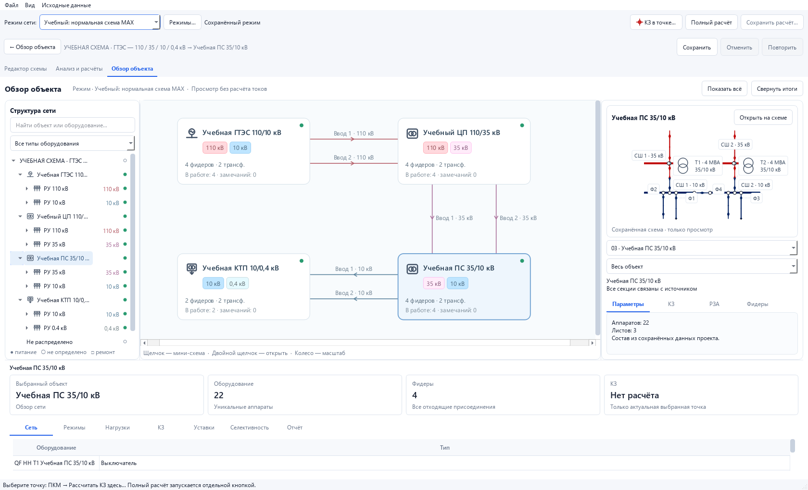

# Общий обзор объекта — компактный вариант · 09.09.2026

**Компактный интерфейсный блок проверен.** Код: `484dfea28b9740d8b4d89e44c5ff524c753e1e19`.
Приложение остаётся версии **0.3.3-safe-hardening**, карта — **4.2**.

## Результат

После выбора проекта открывается обзор с нейтральными контурными значками,
деревом явной принадлежности, карточками объектов и отдельными реальными вводами.
Один щелчок показывает мини-схему; двойной или кнопка открытия переводят на
подробный лист. Возврат сохраняет вид и выделение. Для явно выбранной линии
на уже посещённом листе положение окна меняется так, чтобы линия была видна.

Мини-схема показывает увеличенные native-обмотки Т1/Т2 по 32 экранных пикселя,
мощность, напряжения и секции. Пунктир обозначает выноску к настоящему аппарату,
не электрический провод. Номер фидера сохраняется при выборе РУ, секции и ячейки;
назначение открывается при наведении. Доступен фильтр «Весь объект / РУ».

Обзорные карточки перемещаются с undo/redo и обычным сохранением проекта.
Расположение хранится в расширении рисунка `network_overview_layout_v1`.
Изменение не затрагивает подробные аппараты, маршруты и электрические концы.
Семь нижних вкладок показывают готовые сведения выбранного объекта и причину
отсутствия результата. Обзор не запускает расчёт при выборе или наведении.

## Проверка зафиксированного кода

Затронутый набор из **22 файлов: 319 passed**, 0 failures/errors/skipped,
без предупреждений. Время JUnit — **63,771 с** (pytest: 63,80 с).
Дерево Git перед запуском чистое; контрольные суммы всех отслеживаемых файлов
до и после совпали. [Машиночитаемые доказательства](network-overview-evidence.json)
содержат список файлов тестов и контрольные суммы протоколов.

Проверены навигация и возврат, выбор настоящего листа, устаревшие ссылки,
режимы и ремонт, актуальность точечного КЗ, подписи и фильтр РУ,
отсутствие расчёта/записи настроек при просмотре, сохранение расположения
карточек с undo/redo и save/reload. Соседние проверки запуска, переключения
выключателей, жестов редактора, обновления и старых проектов также прошли.

`ЗАПУСК.bat --smoke-test` завершился с кодом 0. В отдельном процессе Qt
подтверждены видимость и развёрнутое состояние окна, выбранная вкладка обзора
и отсутствие полного расчётного результата. Проверка выполнена с платформой
Qt offscreen; она не описывает состояние уже открытого пользователем окна.

На снимках настоящего Qt проверены окно 1680×1020, мини-схемы ПС и КТП шириной
330 пикселей и отдельные РУ. Т1/Т2 видимы, подписи не накладываются друг на друга.
Дополнительная проба «обзор → мини-схема → подробный лист → обратно» сохранила
fingerprint модели и исходный JSON без появления полного результата расчёта.

Учебная сеть содержит четыре объекта, 16 секций шин, 78 элементов и шесть
межобъектных линий. Оба ввода ЦП, ПС и КТП связаны с разными вышестоящими секциями.
Файлы компактного примера и нефтепромысла, расчётный baseline и его журнал
побайтно совпадают с состоянием `a54b8bf`; SHA-256 приведены в доказательствах.

## Границы результата

Последний полный прогон **3812 passed** относится к предыдущему коду
`35eef5335251d757d6b7178445c85d5a1a1ed645`: [его отчёт](startup-point-fault-2026-09-09.md).
Он не подтверждает более поздние исходники обзора. Новый полный прогон не заявлен;
количества пересекающихся наборов не складываются.

Подготовка топологии нужна для статуса питания; решатель КЗ, полный расчёт защит
и потокораспределение просмотром не запускаются. Состояние питания не доказывает
допустимость нагрузки или успешную работу защиты.

Следующий согласованный шаг после просмотра компактного варианта — группировка
большого нефтепромысла по питающему объекту/секции и ручное назначение принадлежности.
**Эти возможности ещё не реализованы.** Читаемость новой обзорной раскладки на всех
его объектах ещё не принята. Расчётные этапы BU05 и далее остаются открытыми.

[Инструкция обзора](../network-overview.md) · [Текущее состояние](../roadmap/current-state.md).
