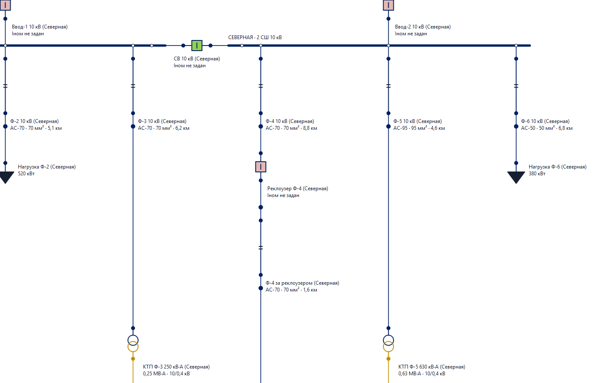
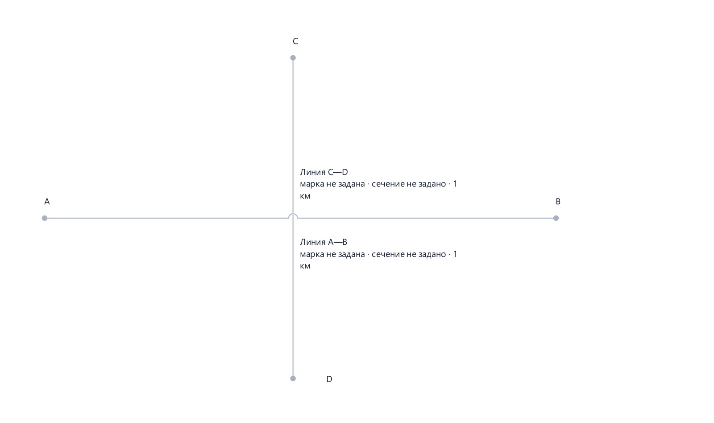

# B3 + визуальные изменения: отчёт объединения

Дата: 31.08.2026. Исполнитель: Sol.
Основание: заказчик попросил перенести визуальные правки из задачи
«Визуальное обозначение оборудования на Однол.схеме» в текущий B3.
Это объединение двух результатов, не начало B9, B4, A3 или A11.

## 1. Входной контроль

Цель: `C:\Users\shock\OneDrive\Desktop\Клауд\rza-calc-0.3-safe-hardening`.
Донор: соседняя `Готовый проект — A2.1\rza-calc-0.3-safe-hardening`.
Вторая задача действительно работала в готовой A2.1; основной B3 был восстановлен
отдельно позднее. Поэтому простая замена папки потеряла бы либо B3, либо визуал.

Прочитаны отчёты донора и сверены реальные файлы с общим исходным A2.1.
Все 374 файла B3 перед переносом совпали с принятым B3 ZIP; его ранее
зафиксированный прогон — 1085 passed. Донор содержит 385 файлов без кэшей.
Исторические числа этих двух веток не выдаются за приёмку текущего объединения.

## 2. Контрольная точка

До правок сохранены оба входа; подробности и SHA-256 в
[контрольной точке](visual-merge-control-point.md).
Внешняя страховочная папка:
`C:\Users\shock\Documents\Codex\2026-08-30\c-users-shock-onedrive-desktop-rza\work\visual-merge-20260831`.

Вход B3: `2f7956d0cfd5d567509f816820d4f58f65f07ddf070779aee71cd6b434343ccd`.
Снимок донора: `22bbd1472ae3259a8912e5e2f7c63d99d4223266f9cd77e869c94ac0c87c5643`.
Зазор подписей 4 единицы и граница масштаба 0,6 зафиксированы до измерения.

## 3. Что перенесено

- Выключатель/реклоузер: квадратный корпус, красноватая заливка замкнутого
  контакта и зелёная разомкнутого; направление полосы показывает положение.
  В монохроме остаются различимые заливки и полосы.
- Общая Qt/SVG-палитра донора, классы напряжения обмоток по смысловым портам.
  Положение контакта, наличие питания и доступность аппарата не смешиваются.
- Утолщённые шины, полые маркеры реальных присоединений, мостики пересечений
  несоединённых проводов. Дуги и разрывы — только отрисовка:
  сохранённые waypoints, электрические узлы и hit-test не заменены дугами.
- Угловой векторный маркер поворота с наведением, предпросмотром,
  подтверждением одной командой, отменой и запретом пересечения аппаратов.
- Новые UI-действия выбирают 90°/180°; отдельная палитра «Электрический узел»
  скрыта. Существующие узлы, автоматические узлы, оба вида шин и низкоуровневый
  четырёхугловой API сохранены. Старые углы 0°/270° не мигрируются при открытии.

## 4. Как сохранён B3

Вместо донорской отдельной подписи имени оставлен один владелец B3:
имя + параметр, типографика и переносы B3, ручной приоритет, сохранение,
undo/redo, переключатели и скрытие ниже 60%. Дублирующего `_name_label` нет.

Все подписи, включая вертикальные линии, остаются горизонтальными.
Это отличие от донора было заранее сообщено заказчику как выбранный вариант
по умолчанию. Явные старые координаты, даже (0,-32), остаются ручными:
«заводское значение» не служит основанием перезаписывать выбор пользователя.

Раскладка учитывает нарисованные дуги, толщины примитивов шин и круги узлов,
а не только исходную осевую линию. Во время поворота подписи контрповёрнуты,
а смещение подписи физической трассы остаётся относительно середины её
логического пути, не середины дуги. Отмена восстанавливает прежнюю раскладку.

При первом объединённом запуске обнаружен и устранён конфликт: обновление
проводов при перетаскивании дочерней подписи сбрасывало её ещё не записанную
позицию. Обработка движения аппарата теперь не вмешивается в движение текста.
Четыре исходных B3 QTest-проверки перетаскивания затем прошли.

## 5. Что не изменено и ограничения

Сохранены все 78 тестов B3. Результаты B4, новая модель A3, оптимизация A11
и этап B9 не реализовывались. B3-PERF-001 остаётся открытым: очень плотные
схемы медленно раскладываются; успешный функциональный тест не означает
приёмки быстродействия.

На старой схеме явные координаты не переписываются. Для автораскладки нужна
команда «Подписи → Автоподписи: выбранные / вся страница». Исходный файл
демо не сохранялся. При невозможности разместить подпись рядом выдаётся
диагностика; идеальная раскладка любой переполненной схемы не обещается.

Профиль методики остаётся ТИПОВЫМ; инженерная и нормативная приёмка не проводилась.
Физической мышью пользователь ещё не принимал результат. QTest и настоящая
отрисовка Windows Qt проверены; это не подмена ручной приёмки.

## 6. Тесты и независимое ревью

Полный итоговый прогон: **1326 passed in 184.91s (0:03:04), 0 failed**.
Сырые результаты: [pytest-full.txt](VisualMerge-Sol-20260831/pytest-full.txt)
и [JUnit XML](VisualMerge-Sol-20260831/pytest-full.xml).
Самый плотный сценарий — 77.67s, сопоставим с 76.92s исходного B3;
он остаётся ограничением B3-PERF-001, не объявляется быстрым.
Команда: `python -B -X utf8 -m pytest -q --capture=sys -p no:cacheprovider --durations=5`.
`--capture=sys` обходит ранее выявленную проблему Windows с наследованием
дескрипторов CLI при fd-capture; исключений и пропусков тестов не вводится.

Совместный целевой набор: **430 passed in 19.43s, 0 failed**.
Семь новых донорских модулей содержат 235 проверок, новый интеграционный модуль —
8 проверок, исходные два B3-модуля — 78. В пяти старых модулях обновлены
ожидания принятой палитры/примитивов/UI-положений; электрические инварианты
не ослаблялись. Независимый измеритель проверяет реальные дуги, толщины и
зазор 4 при масштабе 1 и 0,6.

Итоговое число: 1085 + 235 + 8 − 2 = 1326. Разница −2 — три устаревших
параметризованных ожидания «корпус/обмотки нейтрального цвета» заменены одной
проверкой явных цветовых ролей корпусов и всех обмоток; проверки не скрыты skip.
После актуализации карты/брифа/status: **94 passed in 10.08s, 0 failed**
(roadmap + все B3/integration). current_turn: Max, версия документов 3.8.

Независимое GUI-ревью не нашло подтверждённых регрессий объединения;
119 совмещённых тестов поворота, трасс, палитры и B3 также прошли.
Замечание о защитном refresh при отказе `_move_route_label` не воспроизведено
как пользовательская ошибка, не объявлено исправленным.
GUI smoke: код 0. Таблица демо: 116 OK / 3 FAIL / 0 unresolved,
код 1 соответствует трём прежним содержательным нарушениям.

## 7. Дословная сверка эталона

Команда (без `--yes`):

```text
python -B -X utf8 tools_update_baseline.py --stage VisualMerge --reason "Перенос визуального оформления в B3 без изменений расчёта" --evidence docs/work-verification/visual-merge-report.md
```

```text
Пересчитываю все демо-проекты…

Расхождений с эталоном нет.

Сводка для журнала: Числа не изменились (пересобран только формат снимка).
Этап: VisualMerge
Причина: Перенос визуального оформления в B3 без изменений расчёта
Подтверждение: docs/work-verification/visual-merge-report.md

Числа не изменились — обновлять нечего. Эталон оставлен как есть.
```

Код возврата 0. Эталон и его журнал побайтно прежние.
Эталон: `eb117b54e6117a4c83f612215b6ef7126f1bd303bae524e73fc60649b671f9d0`.
Журнал: `b291569479a64b59da895da2ba4a8761acce64b2e04fbe89b9d5997e2ad745e9`.

## 8. Визуальная проверка

22 свежих PNG настоящего приложения/сцены сохранены в
[VisualMerge-Sol-20260831](VisualMerge-Sol-20260831).
B3 и поворот сняты платформой Qt `windows`, таблица состояний и пересечения —
`offscreen` с местными шрифтами Windows.

На демо четырёх ПС: 157 представлений, 160 трасс, 120 видимых подписей.
До явного сброса старых ручных координат — 32 диагностики; после команды —
0 пересечений в редакторе и анализе. При масштабе <0,6 подписи скрыты.
Проверка усиленным независимым измерителем повторена после фиксации тестов.

Просмотрены плотный участок в цвете/монохроме, таблица состояний, пересечение
без соединения, мостики в обоих направлениях и предпросмотр поворота.
Красные предупреждения на синтетической сцене поворота относятся к намеренно
неподключённым концам тестовой сети, а не ошибке реального демо.





## 9. Файлы и целостность

Изменены редакторские symbols, symbol_svg, orientation, tool_state, controller;
добавлен line_bridges. В GUI объединены editor_scene/editor_panels/strings,
расширен label_layout, добавлены route_bridges и rotation_handle.

`editor/labels.py`, `editor/state.py`, `gui/main_window.py` сохранены побайтно.
56 защищённых файлов (ядро, domain, adapters, topology, calculation, IO, data,
примеры, baseline, журнал, updater и три указанных файла B3) совпадают со
входным B3. Все 385 файлов донора совпадают с его снимком — он не изменён.
Перечень и хеши: [source-integrity.json](VisualMerge-Sol-20260831/source-integrity.json).

Электрический fingerprint демо:
`b275e47230495c199e8c4ad0158838af0f3a3c14a2767fc85a98bbe7a1164445`.
Постоянные ID/роли портов, связи и результаты ТКЗ сохранены;
графические команды не подменяют электрический расчёт.

Исторические отчёты донора сохранены как visio-style-report.md и
two-position-rotation-report.md с явной пометкой о происхождении.

## 10. Выдача

Папка выдачи — существующая отдельная папка
`C:\Users\shock\OneDrive\Desktop\Клауд\Готовый проект — B3`.
Архив результата для Max:
`rza-2026-08-31-B3-visual-merged.zip`, SHA-256 — в соседнем `.zip.sha256`.
В архив входит текущий проект и новая передача, а не старая A2.1.
Следующие этапы требуют отдельной команды заказчика.
